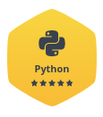
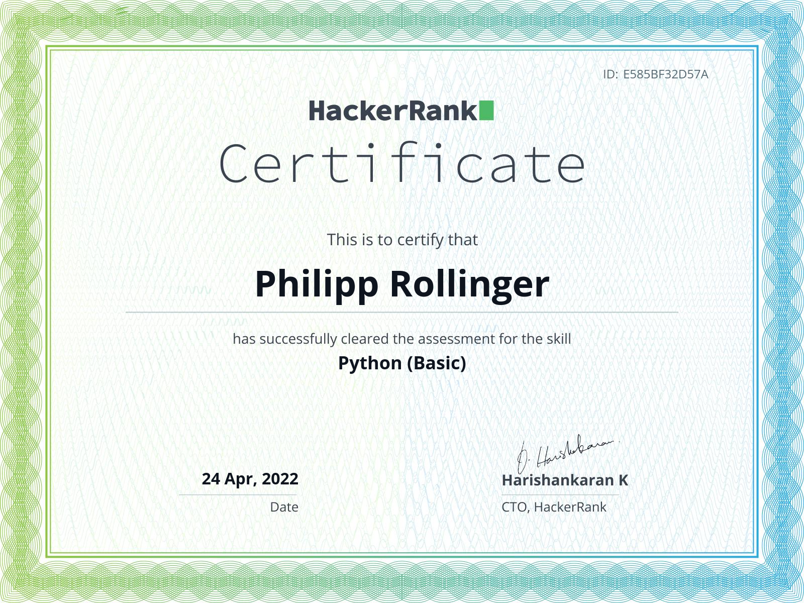

Hi, I’m @rollinger 👋 a Django Full Stack Developer and Creative Explorer of futuristic ideas.

As an experienced full stack Django developer, I have a passion for turning ideas into code and building powerful web applications using the Django framework. My expertise lies in backend development, including server optimization, deployment chain, testing and API development. I have a strong background in developing REST endpoints and server integrations, and I am always eager to take on new and challenging projects. 

You can see a subset of my public and open projects on my GitHub. I am confident that my skills and experience will be valuable in delivering robust and efficient solutions for your project.

- ★ Over 12 years professional experience in Full Stack Django Development. 
- ★ Developing on latest versions (Dj/Py), with code black, PEP-8 and testing.
- ★ GIT and Linux Servers are my second home.
- ★ I am no seasoned designer, yet I can implement the frontend too, making a clean structure for a designer to continue on.
- ★ Currently learning and adding Vue.js to my stack.
- ★ I speak, write, code and work in english, german and spanish with ease. 
- ★ I love travel and to learn new cultures and ways of life.

## HackerRank Profile, Badges & Certificates [View Profile](https://www.hackerrank.com/philipp_rolling1)

