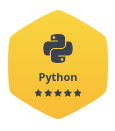
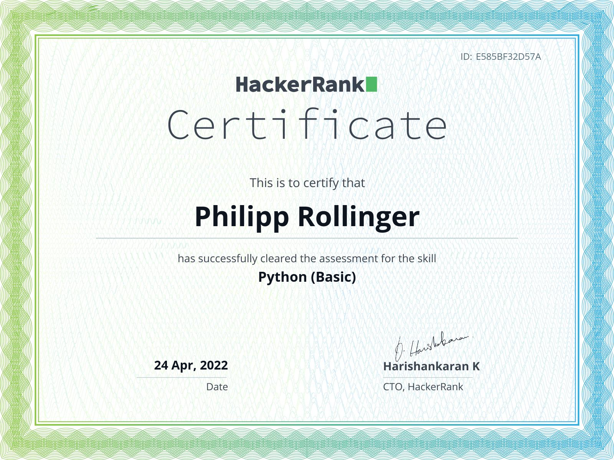

Hi, I'm Philipp. I build tools to build the web, better yet.

My Primary Project: Djxi
I am the core maintainer and architect of Djxi, a robust Django starter kit designed to solve the "boilerplate hell" of modern web development. My goal is to provide a high-quality, production-ready baseline that allows teams to focus on their business logic rather than infrastructure.

What makes Djxi stand out:

✅ Production Ready: Pre-configured for deployment with best practices in security and performance.

✅ Architectural Clarity: Emphasis on clean, decoupled code.

✅ Developer Experience: Focused on automation and reducing manual setup friction.

Beyond the Code:

Professional Background: 15+ years in Software Architecture and Full Stack Development.

Core Tech Stack: Python, Django, PostgreSQL, Docker, Linux.

Mentorship: I actively help developers level up their Python and Django skills.

## HackerRank Profile, Badges & Certificates [View Profile](https://www.hackerrank.com/philipp_rolling1)

